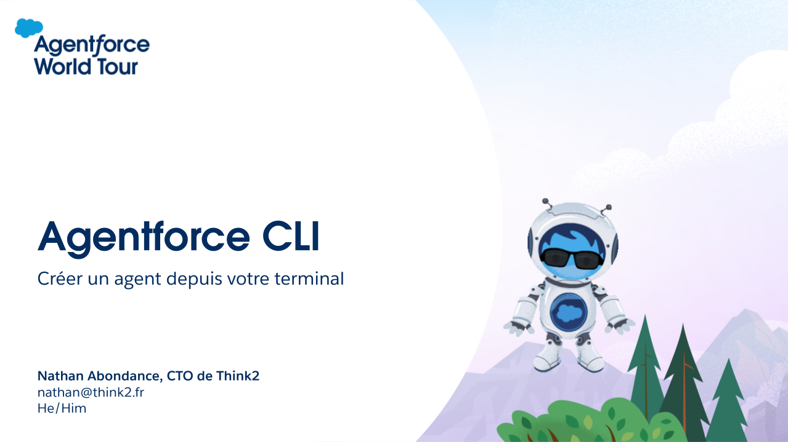

# Agentforce CLI: Créer un agent depuis votre terminal

Ce repo a été créé pour la présentation lors du __Agentforce World Tour Paris 2025__ par _Nathan Abondance_, CTO de [Think2](https://www.think2.ai/).

Pour suivre les évolutions de l'agent cli c'est sur le [repo officiel](https://github.com/salesforcecli/plugin-agent).

Pour discuter et creuser ensemble des sujets Agentforce, [contactez moi](https://www.linkedin.com/in/nabondance/).

🫶